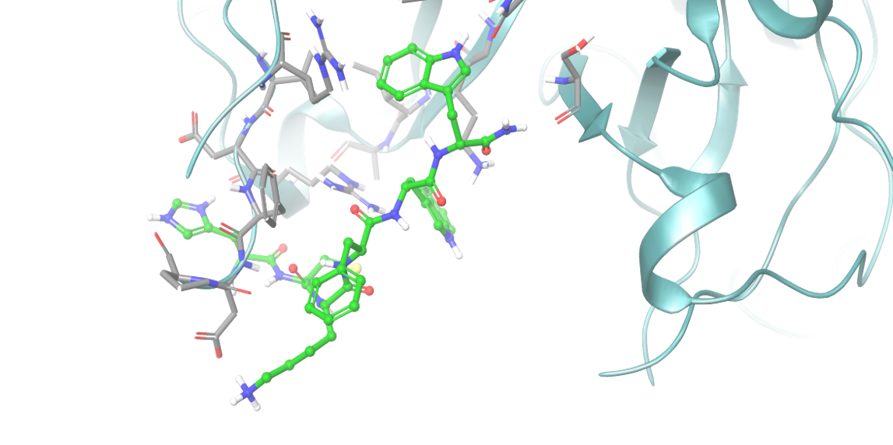
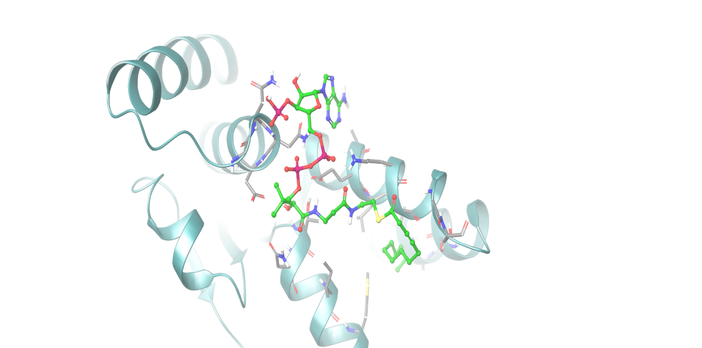

# Toxin-antitoxin-inhibitors-screening
# Structure-Based Drug Design (SBDD): In-Silico Discovery of Toxin-Antitoxin Inhibitors

## 📌 Executive Summary
This project outlines a high-throughput computational pipeline aimed at identifying novel inhibitors for Type II Toxin-Antitoxin (TA) systems (VapBC and MazEF). Utilizing the Schrödinger suite (Maestro), over 1.1 million ligand conformations were screened via molecular docking (Glide & Induced-Fit) to discover lead compounds that prevent bacterial entry into the persister cell state, a major driver of antibiotic resistance.

## 🎯 Biological Targets
The study focused on crucial TA system endoribonucleases that act as molecular switches for bacterial dormancy:
* **MazF Toxin** (PDB IDs: 1UB4, 5XE3)
* **VapC Toxin** (PDB ID: 6NKL)

## 🛠️ Computational Pipeline & Methodology

**1. Target Preparation**
Protein structures were retrieved from the Protein Data Bank and optimized using the **Protein Preparation Wizard** (Schrödinger). Water molecules were resolved, protonation states were assigned, and restrained energy minimization was applied.

**2. High-Throughput Ligand Library Preparation**
To ensure extensive chemical space coverage, two databases were processed using **LigPrep** to generate all possible stereochemical and tautomeric states:
* **NCI Database:** 260,071 initial compounds expanded to **1,156,101 structures**.
* **PharmaLab Database:** 2,112 initial compounds expanded to **12,646 structures**.

**3. Molecular Docking Strategy**
* **Rigid Docking:** A primary high-throughput virtual screening was executed using **Glide** to evaluate binding affinities (Glide Score).
* **Induced-Fit Docking (IFD):** Applied to the top-scoring ligands to simulate the conformational flexibility of the active site upon binding, confirming complex stability.

## 📊 Key Findings & Structural Analysis

The virtual screening successfully identified highly potent candidates with exceptional binding affinities.

### Lead Compound 1: NSC633091 (Target: MazF - 1UB4)
* **Glide Score:** `-10.097 kcal/mol`
* **Interaction Profile:** The ligand demonstrates a robust binding network, including a strong salt bridge with **ASP A:18**, a pi-cation interaction with **LYS A:79**, and multiple hydrogen bonds with **LYS A:79, SER A:80, LYS B:279, and SER B:280**. It is further stabilized by a hydrophobic pocket (VAL, ALA, ILE, PRO).

### Lead Compound 2: NSC618827 (Target: VapC - 6NKL)
* **Glide Score:** `-9.609 kcal/mol`
* **Interaction Profile:** Exhibits strong electrostatic interactions (salt bridge) with **LYS 46** via its phosphate groups. Key hydrogen bonds are formed with **ASN 97, ASN 98, ASP 99, and GLU 43**, while the non-polar segment fits perfectly into a hydrophobic socket (LEU 44, LEU 64, ILE 61, ILE 102).

## 🚀 Future Perspectives
## 📂 Data 
The raw structural data used in this study (protein targets) are available in the repository. You can access the prepared PDB files here:
* [MazF Toxin - 1UB4](data/1UB4.pdb)
* [VapC Toxin - 6NKL](data/6NKL.pdb)

The discovery of these lead compounds provides a strong foundation for developing novel antibacterial adjuvants. Future directions include running Molecular Dynamics (MD) simulations to evaluate the long-term thermodynamic stability of the protein-ligand complexes, followed by in-vitro validation assays.
